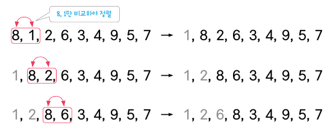
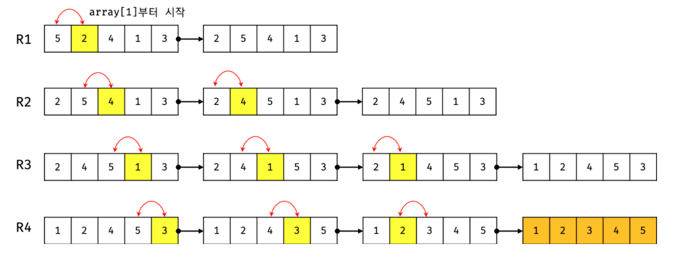

# :books: TIL (2023-01-21)

### DAY 9
🔖 오늘 읽은 범위:
- 에피소드 26. 정렬 알고리즘이 뭐죠?
- 에피소드 27. 스택, 큐가 뭐죠?
- 에피소드 28. 해시 테이블이 뭐죠?
- 에피소드 29. 개발자 필수 소양, 클린 코드!

<br>

> 책에서 기억하고 싶은 내용을 써 보세요.

**<에피소드 26. 정렬 알고리즘이 뭐죠?>**  

버블 정렬은 2칸 짜리 창문을 놓고 오른쪽으로 1칸씩 밀면서 왼쪽과 오른쪽을 비교하는 방식이다. 시간복잡도는 O(N²)이고, 이해하기 쉽지만 효율이 떨어져서 잘 쓰이지 않는다.

 <br>

선택 정렬은 가장 작은 데이터 또는 가장 큰 데이터의 위치를 따로 기억하는 방식으로 작업을 진행한다. 사이클을 돌려 제일 작은 수와 위치를 교환한다. 시간 복잡도는 버블 정렬과 마찬가지로 O(N²)이지만 버블 정렬보다는 효율적이다. 자리를 바꾸는 연산을 사이클당 1번씩만 하기 때문이다.

 <br>

삽입 정렬은 데이터를 비교해서 제일 작은 수를 앞으로 밀어 넣는다. 삽입 정렬은 앞에 있는 데이터를 보면서 배치하는 특징이 있다. 삽입 정렬은 선택 정렬, 버블 정렬보다 빠르지만 시간 복잡도는 마찬가지로 O(N²)이다.

 <br>

위 셋의 정렬은 모두 시간 복잡도가 같지만 속도는 차이 난다. 왜일까?
시간 복잡도가 같다고 한 것은 시간 복잡도를 단순히 측정했을 때 그렇다는 뜻이다.  
알고리즘은 초기 데이터 상태에 따라 처리 속도가 달라진다는 특징이 있어서 기계적으로 측정한 시간 복잡도는 같아도 평균적으로 빠른 알고리즘은 있을 수 있다.

<br>

**<에피소드 27. 스택, 큐가 뭐죠?>**  

사실 큐나 스택은 배열처럼 실제로 존재하는 개념이 아니다. 무슨 말이냐 하면, 큐나 스택은 문법으로 구현되는 것이 아니라는 말이다. 큐나 스택은 기존 프로그래밍 언어의 문법으로 데이터를 저장할 때 어떤 규칙만 부여하기만 하면 된다.  
배열에 큐의 규칙을 부여하면 그 배열은 큐라고 할 수 있다. 이런 개념을 추상 자료구조(abstract data type, ADT)라고 한다.

스택의 규칙 (LIFT: last in, first out = 후입선출)
1. 위에서 데이터를 쌓는다.
2. 위에서부터 데이터를 뺀다

큐의 규칙 (FIFO: first in, first out = 선입선출)
1. 위로 데이터를 쌓는다.
2. 아래에서부터 데이터를 뺀다.

스택이나 큐의 사용 예시
1. 웹 브라우저의 뒤로 가기 버튼은 스택이다.
2. 되돌리기 단축키도 스택이다.
3. 쇼핑몰 주문 처리 시스템은 큐다.

<br>

**<에피소드 28. 해시 테이블이 뭐죠?>** 

해시 테이블은 사전에 비유할 수 있다. 키는 사전에서 단어를, 값은 단어의 뜻을 말한다.

```javascript
menu = [
    { name: "아메리카노", price: 10 },
    { name: "라떼", price: 12 },
    { name: "카모마일차", price: 15 },
    { name: "케이크", price: 45 }
]

menu = {
    "아메리카노": 10,
    "라떼": 12,
    "카모마일차": 15,
    "케이크": 45
}
```

위의 menu처럼 배열로 선언했을 때 라떼의 가격을 찾고 싶다면 배열의 데이터를 처음부터 선형 검색 해야 한다. 하지만 해시 테이블(아래의 menu)을 이용하면 하나하나 찾는 게 아니라 검색하면 되기 때문에 배열보다 빠르다.  
선형 검색의 시간 복잡도는 O(N)이고, 해시 테이블의 시간 복잡도는 O(1)이다.

<br>

**<에피소드 29. 개발자 필수 소양, 클린 코드!>**

클린 코드를 위한 5가지 꿀팁   
1. 의미 있는 변수, 함수의 이름을 적절히 사용하라
```javascript
setInterval(eatKimchi, 86400); // x, 86400이 뭘 뜻하는지 불분명함

const SECONDS_IN_A_DAY = 86400;
setInterval(eatKimchi, SECONDS_IN_A_DAY); // o, 86400이 하루를 초로 바꾼 값인 게 분명하게 보임
```
2. 함수 이름은 가급적 동사로 지어라
```javascript
function userData() {} // x

function loadUserData() {} // o
```
3. 매개변수는 너무 많이 쓰지 마라
```javascript
function makePayment(price, productId, size, quantit, userId) {}
makePayment(35, 5, "xl", 2, "니꼬");
// x, 호출할 때 여러 인잣값이 전달되므로 숫자만 보는 것으로는 함수의 역할을 파악하기 힘듦

function makePayment({ price, productId, size, quantit, userId }) {}
makePayment({
    price: 35,
    productId: 5,
    size: "xl",
    quantity: 2,
    userId: "니꼬"
});
// o, 컨피겨레이션 오브젝트를 사용하면 함수 역할을 파악하기도 쉽고 매개변수가 몇 개 필요한지도 파악 가능
```
4. 불린값을 인자로 보내지 마라  
인자로 불린이 들어오면 보통 그것을 기준으로 if~else 문을 사용한다. 그렇다면 if~else 문에서 불린값의 참, 거짓에 따라 2가지 일을 처리해야 하는데, 이것은 '하나의 함수는 하나의 기능을 해야 한다'는 규칙에 위배된다.
5. 축약어를 쓰지 마라  
나 혼자만 알아볼 수 있을 만한 축약어를 쓰면 안 된다. 예를 들어서 user를 u로 쓰거나, email을 e로 쓰면 안 된다는 것이다.

<br>

> 오늘 읽은 소감은? 떠오르는 생각을 가볍게 적어 보세요.

클린 코드 책을 사 놓긴 했는데 너무 바빠 시간이 없다는 이유로 읽는 것을 미루고 있었다. <IT 5분 잡학사전>을 읽는 게 끝난다면 여유를 가지고 한번 클린 코드 책을 읽어 봐야겠다. 더 이상은 미루지 않을 것이다!! 😎

<br>

> 궁금한 내용이 있거나, 잘 이해되지 않는 내용이 있다면 적어 보세요.

없음.