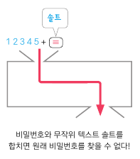

# :books: TIL (2023-01-24)

### DAY 12
🔖 오늘 읽은 범위:
- 에피소드 35. 비밀번호는 어떻게 저장될까?       
- 에피소드 36. 객체 지향 프로그래밍이 뭐죠? ①  
- 에피소드 37. 객체 지향 프로그래밍이 뭐죠? ②
- 에피소드 38. 함수형 프로그래밍이 뭐죠?  

<br>

> 책에서 기억하고 싶은 내용을 써 보세요.

**<에피소드 35. 비밀번호는 어떻게 저장될까?>**  

비밀번호를 그대로 데이터베이스에 저장하면 안 된다.  
입력한 값을 무작위 값으로 변환시켜 주는 해시 함수를 사용해서 저장해야 한다. 

해시 함수는 동일한 입력값에 대해 동일한 출력값을 가지고, 입력값이 살짝만 바뀌어도 출력값이 엄청나게 바뀐다는 특징이 있다. 그리고 반대로 입력한다고 해서 원래 값이 나오지 않는다.

해시 함수가 변경한 값을 원래의 값과 연결해 놓은 레인보우 테이블이라는 게 있는데, 이것 때문에 해시 함수는 완벽하지 않다. 이럴 때는 솔트라는 무작위 텍스트를 이용하면 된다.



<br>

**<에피소드 36-37. 객체 지향 프로그래밍이 뭐죠?>**  

프로그래밍 패러다임은 프로그래머가 프로그래밍을 할 때의 관점, 방식 이런 것을 말한다. 프로그래밍 언어는 프로그래밍 패러다임을 하나 또는 하나 이상 지원한다. 예를 들어서 자바는 객체 지향 프로그래밍, 함수형 프로그래밍을 지원한다.  
대표적인 프로그래밍 패러다임으로는 절차 지향 프로그래밍, 객체 지향 프로그래밍, 함수형 프로그래밍이 있다.

객체 지향 프로그래밍은 클래스, 상속을 이용해 코드의 재사용성을 늘린 효율적인 방법을 추구한다!

<br>

**<에피소드 38. 함수형 프로그래밍이 뭐죠?>**

함수형 프로그래밍을 배워야 하는 이유는 '버그가 발생하기 어려운 구조'라서 개발자에게 매우 유용하기 때문이다.

홀수를 제거하는 코드를 함수형 프로그래밍으로 작성해 보기
```javascript
function checkForOdd(item) {
    return item % 2 === 0;
}

function removeOdd(items) {
    return items.filter(checkForOdd);
}
```
주목해야 할 것은 filter의 인자로 checkForOdd라는 함수를 보냈다는 것이다.

<br>

> 오늘 읽은 소감은? 떠오르는 생각을 가볍게 적어 보세요.

프로그래밍 패러다임에 대해 더 자세히 알아보고 싶다. 이런 걸 만든 사람들은 어떤 생각을 가지고 만든 걸까?

<br>

> 궁금한 내용이 있거나, 잘 이해되지 않는 내용이 있다면 적어 보세요.

레인보우 테이블에 대한 내용이 자세히 서술되어 있지는 않아서, 정확히 어떻게 생겼는지, 어떤 방식으로 만들어졌는지 궁금하다.